# **LABORATORIO 5: USO DE BITalino PARA ECG**
# **Tabla de contenidos**

1. [Introducción](#id1)
2. [Objetivos](#id2)
3. [Materiales y equipos](#id3)
4. [¿Cómo funciona el ECG en un Bitalino? ](#id4)
5. [Metodología](#id5)
6. [Pruebas](#id6)
7. [Resultados](#id7)
   - [Sujeto 1](#sujeto-1)
   - [Sujeto 2](#sujeto-2)
   - [Sujeto 3](#sujeto-3)
8. [Referencias](#id8)
   
## **Introducción** 

La electrocardiografía (ECG) es una señal biológica que registra el proceso de latido del corazón mediante la medición del voltaje a lo largo del tiempo. Se realiza mediante la colocación de electrodos externos en la piel humana [1]. La ECG se utiliza principalmente para obtener información sobre la frecuencia cardíaca (pulso cardíaco), el ritmo y la actividad eléctrica del corazón. Esta técnica captura los puntos clave del cuerpo humano y genera una señal de voltaje cuasiperiódica no lineal y no estacionaria [2]. Asimismo, la ECG ofrece la ventaja de ser un procedimiento de bajo costo y de respuesta inmediata. Para registrar un ECG, se mide la diferencia de potencial entre los electrodos que se colocan en la piel del paciente. Esta medición permite obtener una representación gráfica de los impulsos eléctricos del corazón, lo que proporciona información valiosa sobre su funcionamiento [3].

La señal de ECG tiene una amplitud pequeña, típicamente 2.5 mV en un entorno de desplazamiento de 400 mV, y los componentes de frecuencia de una señal de ECG típica están en el rango de 0.05–150 Hz [4]. Cada señal de ECG tiene puntos fiduciales (P, Q, R, S, T, U) y varios intervalos (S-T, Q-T, P- R, R-R) [3], como se observa en la Figura 1.

- La onda P es el resultado de la despolarización de la aurícula y el ventrículo provoca el resto de picos.
- Intervalo PR representa el tiempo desde el comienzo de la despolarización auricular hasta el comienzo de la despolarización ventricular e incluye el retraso en el nodo AV.
-El complejo QRS es la despolarización de ambos ventrículos cardiacos, utilizado como punto de referencia para el análisis de señales.
- El intervalo QT es un indicador de la repolarizacíón ventricular
- El segmento ST representa el final de la despolarización ventricular y el comienzo de la repolarización ventricular
- La onda Q representa la despolarización del tabique interventricular.
- La onda R representa el estímulo eléctrico a medida que pasa por los ventrículos durante la despolarización.
- La onda S representa la despolarización final de las fibras de Purkinje.
- La onda T representa la repolarización ventricular [3].

Figura 1. Análisis de la señal ECG 

* Derivaciones Cardiacas:
  Son las vistas del corazón que representan su actividad de potencial eléctrico en diferentes planos, estas son 12 y se dividen entre derivaciones de extremidades y precordiales.

   * Derivaciones de extremidades:
     Son el registro de la diferencia de potenciales eléctricos entre dos puntos, ya sea entre dos electrodos (bipolar) o entre un punto virtual y un electrodo (monopolares). Como su nombre indica estas son tomadas en las extremidades, siendo RA (right arm), LA (left arm), RL (right leg) y LL (left leg). 

I, II y III: derivaciones bipolares; aVF, aVL y aVR: derivaciones monopolares

   * Derivaciones precordiales:
     Se obtienen registrando la actividad eléctrica del corazón desde puntos en la superficie del tórax. Estas derivaciones son importantes para evaluar la actividad eléctrica del corazón desde una vista frontal y proporcionar información sobre la actividad en diferentes regiones del miocardio.

## **Objetivos** 

- Adquirir señal biomédica de ECG.
- Hacer una correcta configuración de BiTalino.
- Extraer la información de la señal ECG del software OpenSignals (r)evolution
  
## **Materiales y equipos** 

| Material   | Imagen   |
|:-------------: |:---------------:| 
| **BITalino**: es un kit electrónico formado por varios módulos individuales que se utilizan para la recogida de datos biomédicos. Incluye sensores inalámbricos y una plataforma de software para adquirir, procesar y visualizar datos biomédicos         |        |
| **Fluke ProSim 4 Vital Signs Patient Simulator**: es un simulador de paciente que imita los signos vitales del paciente, como la presión arterial, la frecuencia cardiaca y la respiración, para ayudar en el entrenamiento y prueba de equipos médicos          |           |
| **OpenSignals Software**: Se puede conectar mediante Bluetooth a la placa BITalino y permite adquirir y visualizar bioseñales          |       |
***

## **¿Cómo funciona el ECG en un Bitalino?** 
La adquisición de la señal de ECG con BITalino es no invasiva; el ECG se detecta mediante tres electrodos de Ag-AgCl. BITalino permite una medición de un solo derivación con una frecuencia de muestreo (fs) de 10/100/1,000 Hz. El ancho de banda es de 0.5-40 Hz, y se garantiza la precisión en este rango. El sistema también transfiere frecuencias desde 40 Hz hasta la mitad de la frecuencia de muestreo, pero con menor magnitud. La resolución de la señal de ECG es de 10 bits. El rango de voltaje adquirido está limitado a (-1.5, +1.5) mV. Los datos pueden visualizarse mediante el software OpenSignals, que permite la adquisición de datos en tiempo real y la exploración fuera de línea. Los datos registrados pueden almacenarse en formato de archivo ASCII estándar (.txt) o en formato HDF5.

## **Metodología: Configuración de ECG en Bitalino:** 

Mientras realizamos la revisión de guías clínicas encontramos una titulada: *“Recommendations for ECG adquisition using Bitalino”*. En este estudio se enfocaron en encontrar cuales serían las mejores formas de adquirir la señal de electrocardiograma con el dispositivo en el que consideraban factores como la frecuencia de muestreo y el lugar de colocación de los electrodos por lo que seguimos sus recomendaciones.

**Frecuencia de Sampleo**

En el caso de la frecuencia de muestreo se determinó que debe establecerse en función de la información diagnóstica requerida. Una frecuencia de muestreo (Fs) de 100 Hz es suficiente para el monitoreo del ritmo. Para la evaluación de la morfología, es necesario utilizar una frecuencia de muestreo de 1,000 Hz.

**Colocación de electrodos**

Adicionalmente en el estudio se testearon 12 lugares de colocación diferentes. La ubicación de los electrodos se determinó en función de los derivaciones estándar del ECG, la accesibilidad a las partes del cuerpo, las amplitudes supuestas y el diseño de BITalino. El conjunto de derivaciones tiene una longitud de 30 cm, lo que significa que la distancia entre dos electrodos (partes del cuerpo) no debe ser superior a 60 cm. De las derivaciones estándar del ECG, solo tenemos en cuenta las derivaciones de miembros (porque son bipolares). Además, la distancia entre la mano y la pierna es mayor de 60 cm, por lo que la detección resulta muy incómoda. La única derivación estándar que se puede utilizar es la derivación de miembros (mano izquierda, mano derecha). Esta derivación fue la que utilizamos para nuestra adquisición de señales, como se observa la Figura 2.

Figura 2. Ubicación de electrodos en las pruebas

## **Pruebas** 

## **Resultados** 
Para este laboratorio usamos 3 sujetos de prueba los cuales fueron medidos en 2 estados. 
Primero en reposo sentados con ambos brazos recostados sobre las piernas. Y el segundo estado luego de haber efectuado una actividad física (sentadillas con salto y correr 100 metros a maxima velocidad)
## Sujeto 1 
### Reposo

   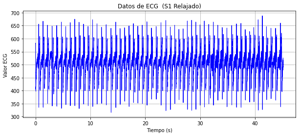
   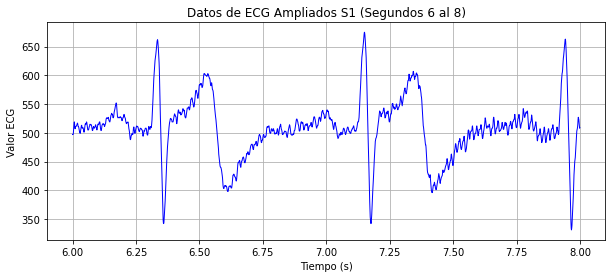

### Activo

   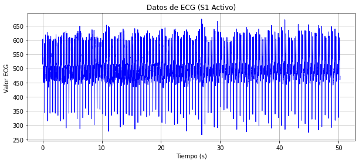
   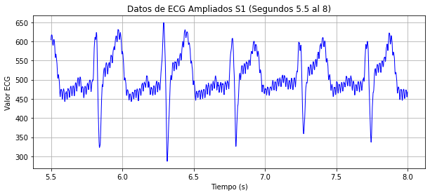

## Sujeto 2 
### Reposo

   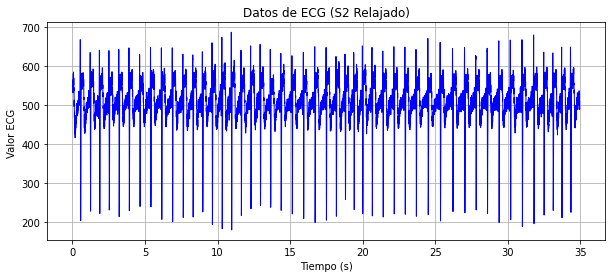
   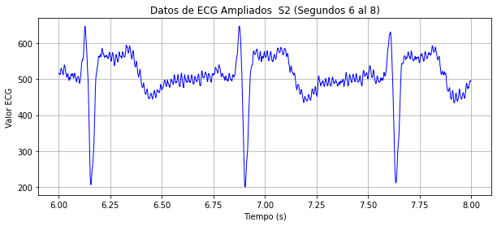

### Activo

   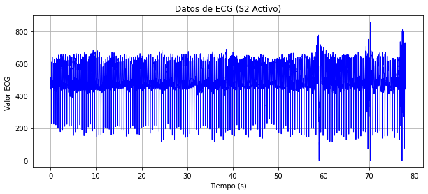
   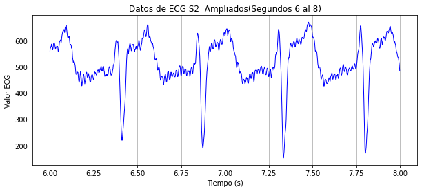

## Sujeto 3 
### Reposo

   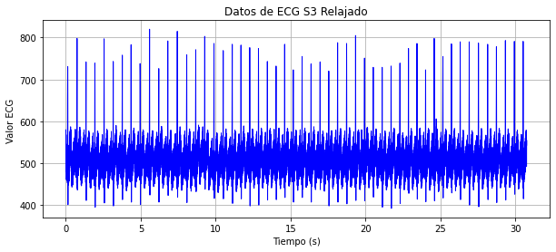
   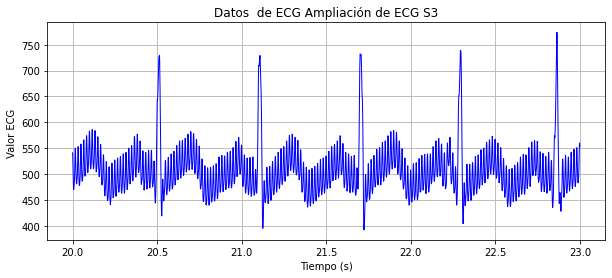

### Activo

   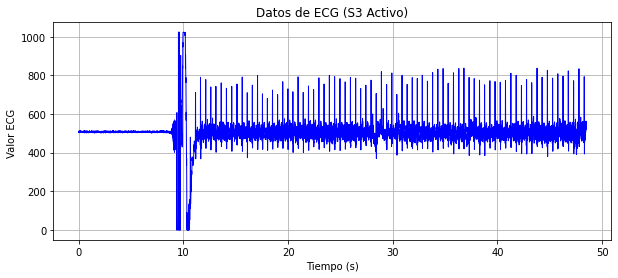
   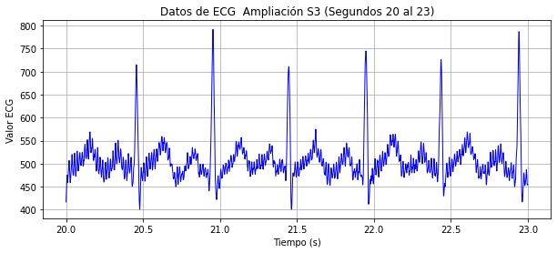

## **Referencias** 
[1]	A. Sheta et al., «Diagnosis of Obstructive Sleep Apnea from ECG Signals Using Machine Learning and Deep Learning Classifiers», Applied Sciences 2021, Vol. 11, Page 6622, vol. 11, n.o 14, p. 6622, jul. 2021, doi: 10.3390/APP11146622.

[2]	S. Chatterjee, R. S. Thakur, R. N. Yadav, L. Gupta, y D. K. Raghuvanshi, «Review of noise removal techniques in ECG signals», IET Signal Processing, vol. 14, n.o 9, pp. 569-590, dic. 2020, doi: 10.1049/IET-SPR.2020.0104.

[3]	J. Aspuru et al., «Segmentation of the ECG Signal by Means of a Linear Regression Algorithm», Sensors 2019, Vol. 19, Page 775, vol. 19, n.o 4, p. 775, feb. 2019, doi: 10.3390/S19040775.

[4]	A. : Meyer, H. A. Brochero, y C. A. Rojas, «SISTEMA PARA EL MONITOREO DE EPISODIOS DE LA APNEA DEL SUEÑO».
