# LABORATORIO 5: Procedimiento de registro EEG
# **Tabla de contenidos**

1. [Introducción](#id1)
2. [Objetivos](#id2)
3. [Materiales y equipos](#id3)
4. [Procedimiento](#id4)\
4.1 [Medición y Adquisición por electrodos](#id5)\
4.2 [Protocolo de adquisición](#id6)
5. [Resultados](#id7)\
    5.1 [Bitalino](#id8)\
        5.1.1 [Fotos de Conexión](#id9)\
        5.1.2 [Gráficas del Bitalino](#id10)\
        5.1.3 [Observaciones](#id11)\
    5.2 [UltraCortex](#id12)\
        5.2.1 [Foto Conexion](#id13)\
        5.2.2 [Gráficas del UltraCortex](#id14)\
        5.2.3 [Observaciones](#id15)
6. [Conclusiones](#id16)
7. [Referencias](#id17)
   
## **Introducción** 

El cerebro humano está formado por alrededor de 85.000 millones de neuronas que desempeñan un papel fundamental en la comunicación a través de conexiones llamadas sinapsis que se encuentran en los extremos de los axones. Estas neuronas transmiten información mediante la liberación de neurotransmisores, lo que provoca cambios en el voltaje en la membrana celular. Esto da lugar a la generación de un campo eléctrico que dura solo unos cientos de milisegundos, conocido como potencial postsináptico. [1]

El sistema nervioso es una compleja red de estructuras especializadas que regula el funcionamiento de los órganos y sistemas del cuerpo, así como la interacción del organismo con el entorno. Este sistema está diseñado para generar respuestas a cambios tanto internos como externos, evaluando la información que recibe. [2]

El cerebro humano se divide en cuatro áreas principales conocidas como lóbulos: el frontal (en naranja), el temporal (en verde), el parietal (en azul) y el occipital (en amarillo), como se muestra en la Figura 1. Cada uno de estos lóbulos se ha subdividido y se asocia con funciones cerebrales específicas. Nos centraremos en el lóbulo frontal en este laboratorio, ya que es responsable de controlar los movimientos voluntarios, tomar decisiones, llevar a cabo procesos cognitivos como la planificación y la atención, y se considera el centro de nuestra personalidad. [3]

Figura 1. El cerebro y sus lóbulos superficiales [3]

Un electroencefalograma (EEG) es un procedimiento médico que registra la actividad eléctrica en el cerebro utilizando electrodos colocados en el cuero cabelludo o cerca de la parte superior de la cabeza. Las neuronas en el cerebro se comunican entre sí mediante impulsos eléctricos que están en constante actividad. Esta actividad se representa como patrones de ondas en el registro del EEG. [4]
El sistema de colocación de electrodos denominado "internacional 10-20" se utiliza para posicionar los electrodos en lugares estandarizados identificados por las letras F (frontal), C (central), P (parietal), T (temporal) y O (occipital) en el cuero cabelludo. El EEG se emplea para diagnosticar diversos trastornos, como convulsiones, problemas en el tronco encefálico, lesiones cerebrales y alteraciones en el estado de conciencia. Las señales eléctricas generadas por la actividad cerebral normal presentan amplitudes atípicas en el rango de 30 a 100 milivoltios y exhiben variaciones irregulares en el tiempo. El EEG permite medir cinco sub-bandas de frecuencia que definen las frecuencias de las señales cerebrales, desde las más rápidas, conocidas como gamma, hasta las más lentas, denominadas delta, como se ilustra en la Figura 2. [5]

 

Figura 2. EEG bandas de frecuencia, ocurrencia y tareas para activar la potencia de banda [3]

## **Objetivos** 
- Adquirir señal biomédica de EEG.
- Hacer una correcta configuración de BiTalino.
- Extraer la información de la señal EEG del software OpenSignals (r)evolution.
- Analizar la señal EEG obtenida con el OpenBCI.

## **Materiales y Equipos** 

| Material   | Imagen Referencial  |
|:-------------: |:---------------:| 
| **BITalino:** es un kit de herramientas de prototipado rápido para proyectos de salud y bienestar personal. Incluye sensores inalámbricos y una plataforma de software para adquirir, procesar y visualizar datos biomédicos         |        |
| **OpenBCI GUI:** es un software crea herramientas de código abierto para biodetección y neurociencia.         |      |
| **OpenSignals Software:**: Se puede conectar mediante Bluetooth a la placa BITalino y permite adquirir y visualizar bioseñales          |       |
| **Ultracortex "Mark IV" EEG Headset:** permite adquirir hasta 16 canales de datos de EEG y puede combinarse con la placa OpenBCI Ganglion, Cyton o CytonDaisy.          |      |

## **Procedimiento** 

### **Medición y Adquisición por electrodos** 

Como se mencionó al inicio, en el presente laboratorio se medirán las señales EEG mediante 2 dispositivos diferentes: ULTRACORTEX y BITalino
Los pasos son los siguientes:

#### ULTRACORTEX:
* Descargar el programa OpenBCI GUI para la conexión y visualización con el ULTRACORTEX headset
* Insertar el OpenBCI USB Dongle en su ordenador y encenderlo junto al ULTRACORTEX headset (mediante un switch), se encenderá una luz azul en ambas placas.
* Emparejar el dongle con el Ultracortex

Para información más detallada revisar el siguiente enlace:
Guía de inicio: https://docs.openbci.com/GettingStarted/Boards/CytonGS/

#### BITalino:
* Descargar el programa OpenSignals
* Encender la placa del BITalino (mediante un switch), se encenderá una luz blanca intermitente
* Conectar mediante bluetooth a su ordenador, luego emparejarlo con el programa OpenSignals utilizando el canal de EEG (canal 3)
* Una vez establecida la conexión, colocar los electrodos (positivo, negativo y referencia) como se muestra a continuación

Para información más detallada revisar el siguiente enlace:
Guía de inicio: https://support.pluxbiosignals.com/wp-content/uploads/2021/11/bitalino-quickstart-guide-10010-print.pdf
Manual de usuario: https://support.pluxbiosignals.com/wp-content/uploads/2021/11/bitalino-revolution-user-manual.pdf

### **Protocolo de adquisición** 
Para empezar a realizar la medición de señales se le pide al sujeto de prueba realizar las siguientes actividades a continuación

* Estado de reposo (respiración normal)
* Sin movimientos oculares (ojos cerrados)
* 5 ciclos de ojos abiertos - ojos cerrados durante 5 segundos cada fase
* Resolución mental de ejercicios matemáticos 3 fáciles y 3 difíciles

Una vez obtenidas y grabadas de manera independiente, exportarlas al programa de su preferencia, en este caso se trabajará con lenguaje Python para su muestreo y análisis.

## **Resultados** 

### **Bitalino** 

#### **Conexión & Uso** 

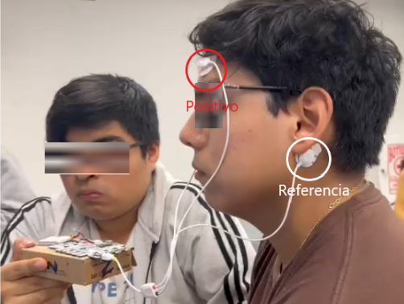

#### **Gráficas del BItalino** 

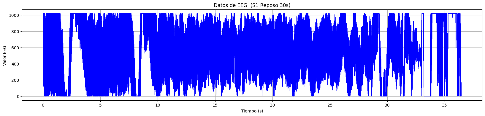
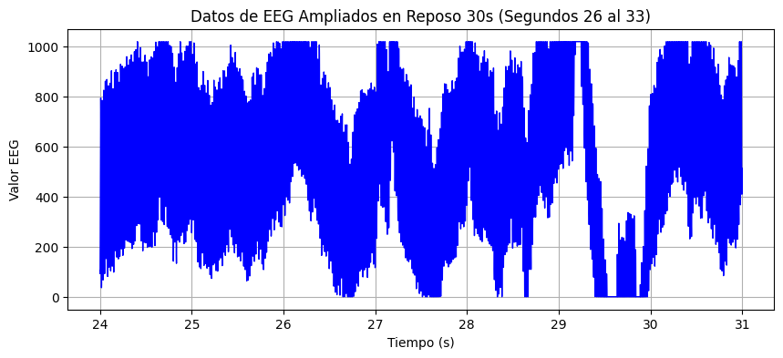
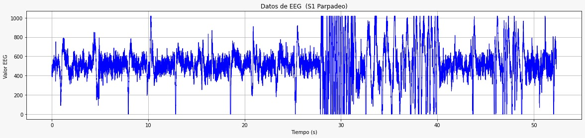
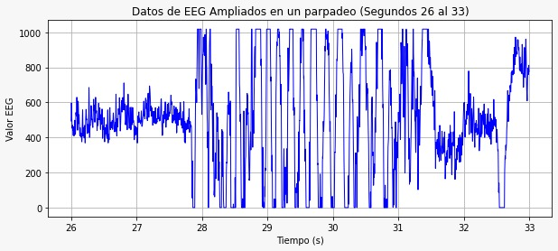
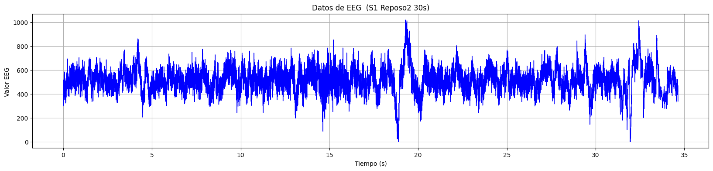
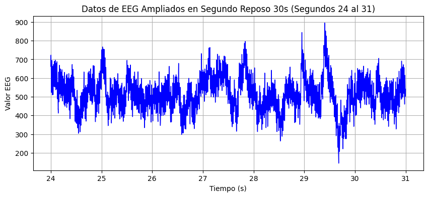
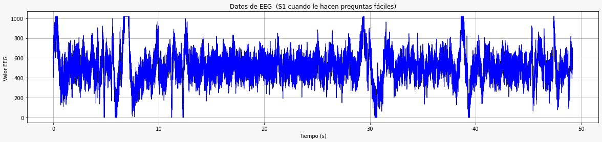
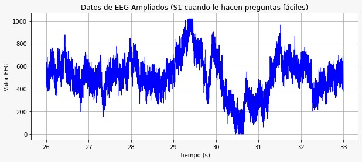
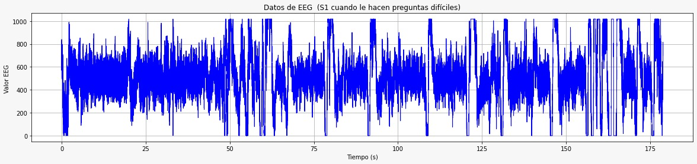
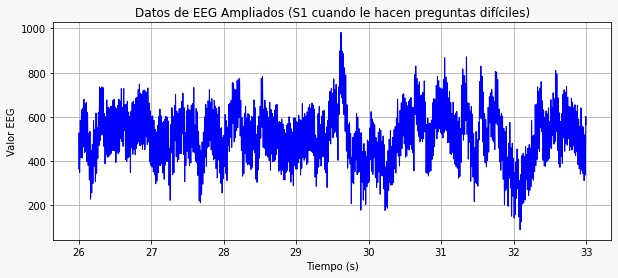

#### **Observaciones** 
asdadsas

### **UltraCortex** 

#### **Conexión & Uso** 

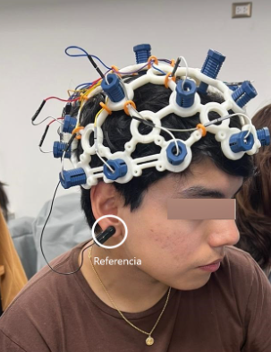

#### **Gráfica UltraCortex** 

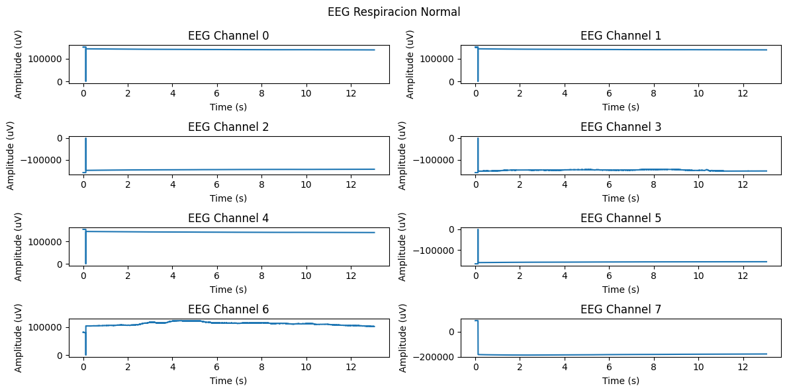
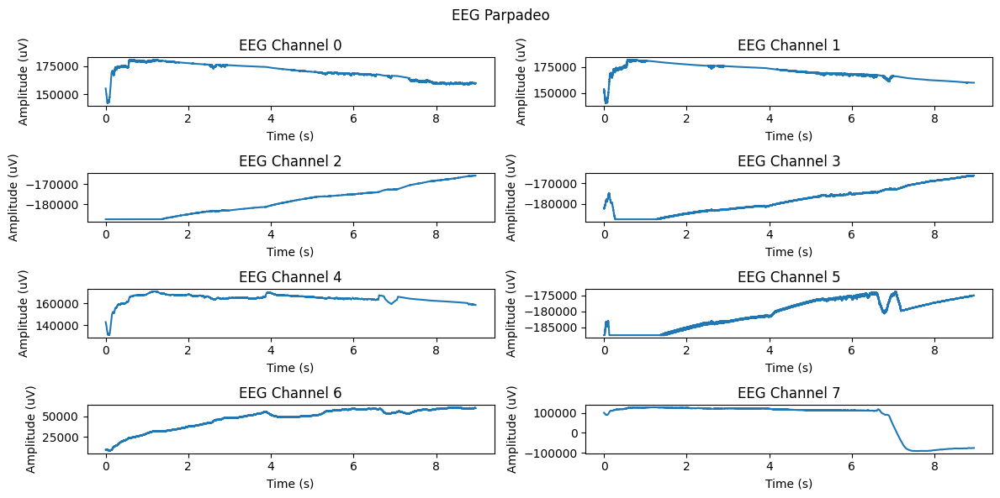
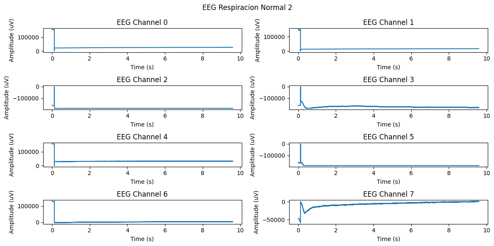
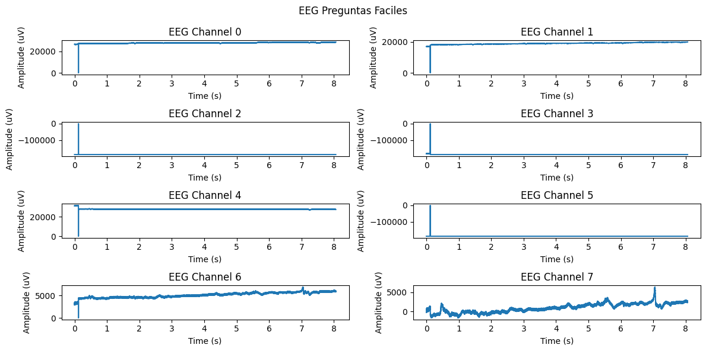
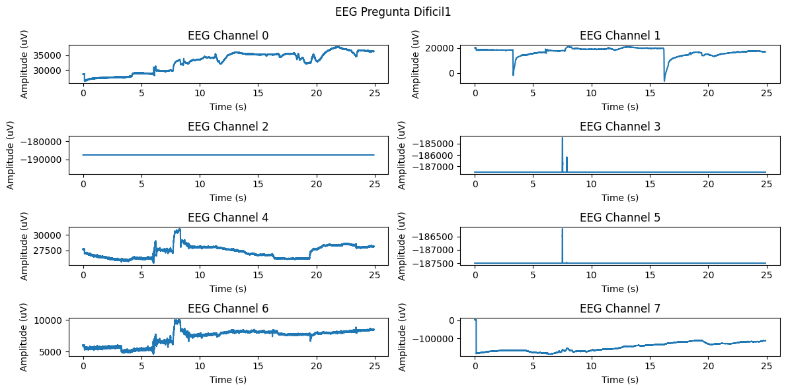
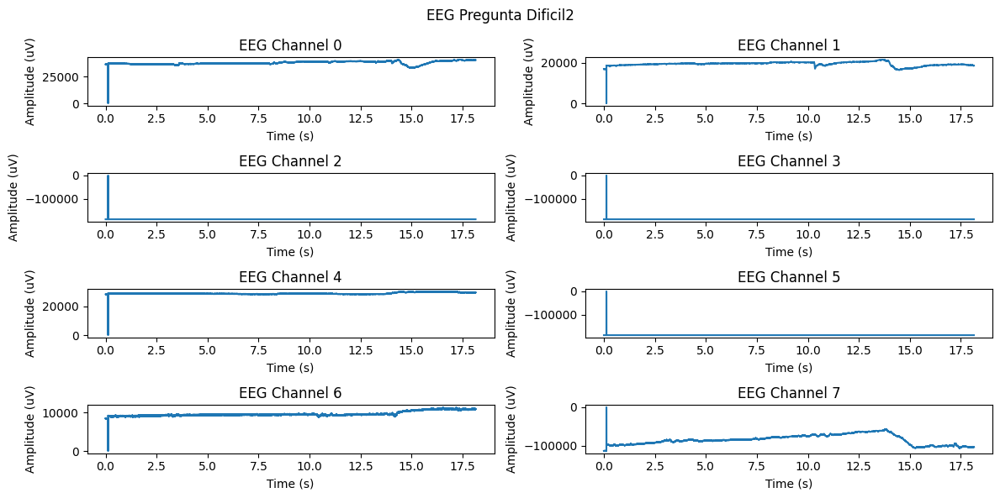

#### **Observaciones** 

## **Conclusiones** 

## **Referencias** 
[1]    	S. Herculano-Houzel, «The Human Brain in Numbers: A Linearly Scaled-up Primate Brain», Front Hum Neurosci, vol. 3, n.o NOV, nov. 2009, doi: 10.3389/NEURO.09.031.2009.

[2]    	«EEG (Electroencephalography): The Complete Pocket Guide - iMotions». Accedido: 30 de septiembre de 2023. [En línea]. Disponible en: https://imotions.com/blog/learning/best-practice/eeg/

[3] 	“BITalino (r)evolution Lab Guide.” Disponible en: https://support.pluxbiosignals.com/wp-content/uploads/2022/04/HomeGuide3_EEG.pdf

[4] 	Graetzer DG PhD. “Electroencephalography (EEG)”. Magill’s Medical Guide. 
Accedido: 30 de septiembre de 2023. [En línea]. Disponible en:
https://search-ebscohost-com.ezproxybib.pucp.edu.pe/login.aspx?direct=true&db=ers&AN=87690502&lang=es&site=eds-live&scope=site

[5]    	S. U. C. M. Ehrotra, Introduction To EEG- and Emotion Recognition. 2018. Accedido: 30 de septiembre de 2023. [En línea]. Disponible en: http://www.sciencedirect.com:5070/book/9780128044902/introduction-to-eeg-and-speech-based-emotion-recognition
