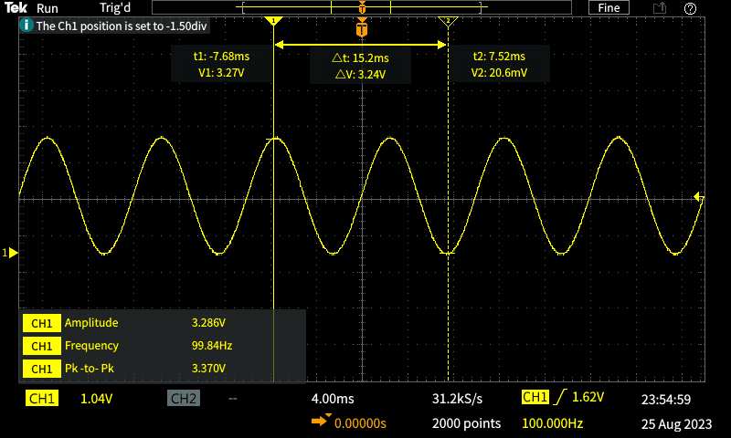
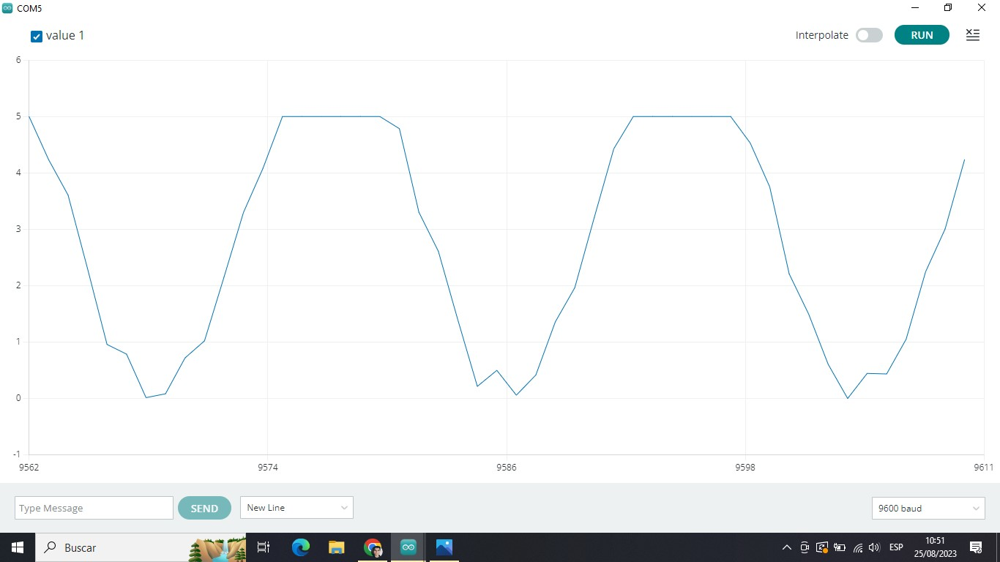
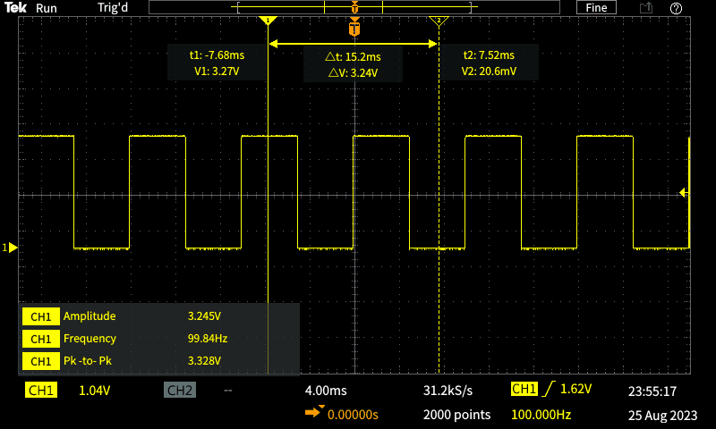
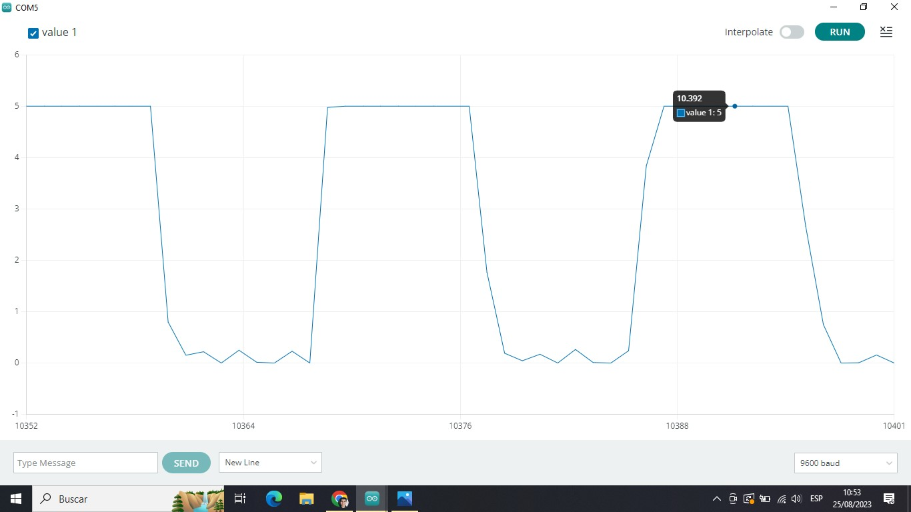
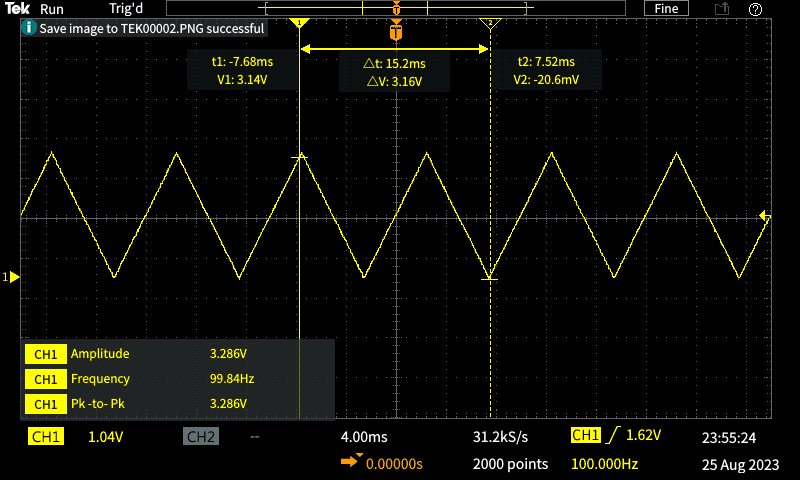
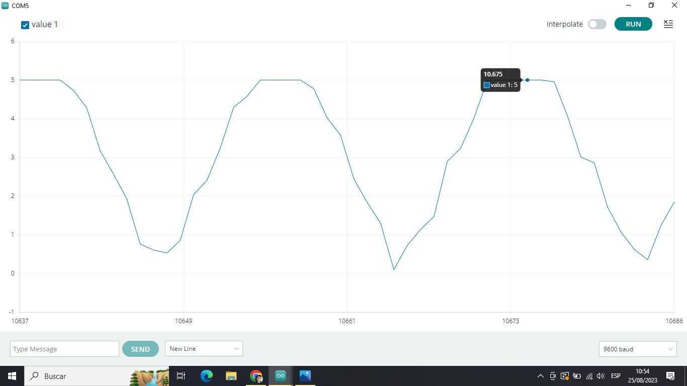

## LABORATORIO 2 – ADQUISICIÓN DE SEÑALES Y GRAFICACIÓN EN ARDUINO
---
### Integrantes del GRUPO 1
* Dante Rodriguez - a20203483@pucp.edu.pe
* Katherine Zorrilla - kpzorrilla@pucp.edu.pe
* Diego Palacios - d.palaciose@pucp.edu.pe
* Luis Chirre - luis.chirre@upch.pe

### Entregables
* Plotear al menos 3 señales en Arduino IDE provenientes del generador de señales.
* Comparar las señales graficadas del Arduino IDE con las gráficas obtenidas del osciloscopio.
---
### Ploteo de señales en Arduino

Primero tenemos la configuracion inicial del osciloscopio, el generador de ondas y el arduino.

Configuración inicial del Osciloscopio


Configuracion Inicial del Generador de ondas


Conexión del Arduino NANO 33 IOT con la señal del generador de señales


Codigo usado para el arduino
```
const int analogPin = A0;    // Analog input pin
const int numSamples = 10000;  // Number of samples to collect
const int sampleInterval = 10; // Time between samples in milliseconds


void setup() {
  Serial.begin(9600);
}


void loop() {
  for (int i = 0; i < numSamples; i++) {
    int sensorValue = analogRead(analogPin);
    float voltage = sensorValue * (5.0 / 1023.0); // Convert to voltage (5V reference, 10-bit ADC)
    Serial.println(voltage, 4); // Print voltage value with 4 decimal places
    delay(sampleInterval);
  }
  Serial.println(); // Separate readings from different sweeps
  delay(1000);      // Delay between sweeps
}
```
---
### Señales generadas

#### Onda sinusoidal del generador de señales:


#### Onda sinusoidal a 100Hz En el Serial Plotter de Arduino IDE:


---
#### Onda cuadrada del generador de señales:


#### Onda cuadrada a 100Hz En el Serial Plotter de Arduino IDE:


---
#### Onda triangular del generador de señales:


#### Onda triangular a 100Hz En el Serial Plotter de Arduino IDE:



